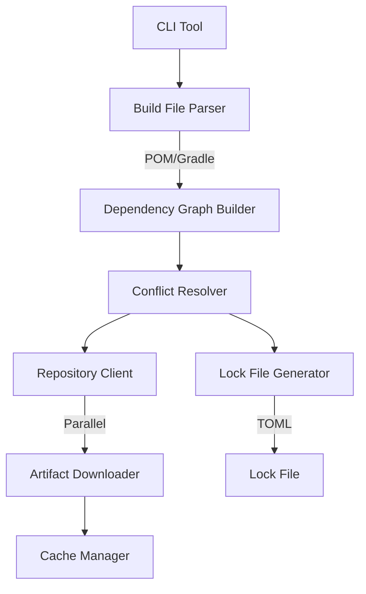

# jv

A fast, Rust-based Java dependency resolver inspired by [uv](https://github.com/astral-sh/uv). Resolve Maven and Gradle dependencies with 10–100x speedups over traditional tools.

## Overview

`jv` is a standalone dependency resolver for Java projects that provides:
- **Fast dependency resolution** using Rust's performance advantages
- **Parallel artifact downloads** with smart caching
- **Deterministic lock files** in TOML format (similar to `Cargo.lock`)
- **Maven and Gradle support** for parsing build files
- **Conflict resolution** using industry-standard algorithms

## Motivation

Maven and Gradle can be painfully slow on large projects with complex dependency graphs. Build times remain a common pain point for Java developers. `jv` applies the same performance principles that made `uv` revolutionary for Python to the Java ecosystem.

## Features

### Phase 1 (Current Focus)

- [ ] Parse Maven POM files with inheritance and multi-module support
- [ ] Parse Gradle build files (Groovy DSL, basic support)
- [ ] Resolve transitive dependencies with conflict resolution
- [ ] Support Maven repositories (Maven Central and custom repos)
- [ ] Parallel artifact downloading with connection pooling
- [ ] Smart local caching (content-addressable storage)
- [ ] Generate deterministic TOML lock files
- [ ] CLI interface with progress reporting

### Future Phases

- Phase 2: Gradle/Maven plugin integration
- Phase 3: Full build system capabilities

## Architecture



## Installation

*Coming soon - installation instructions will be available once Phase 1 is complete.*

## Usage

### Resolve Dependencies

Generate a lock file from your project's build file:

```bash
# For Maven projects
jv resolve pom.xml

# For Gradle projects
jv resolve build.gradle

# Output: jv.lock
```

### Verify Lock File

Check if your lock file matches the current dependencies:

```bash
jv verify
```

### Update Dependencies

Update a specific dependency:

```bash
jv update com.example:artifact:1.0.0
```

## Project Structure

```
jv/
├── Cargo.toml                 # Project configuration
├── README.md                  # This file
├── src/
│   ├── main.rs               # CLI entry point
│   ├── cli.rs                # Command-line argument parsing
│   ├── parser/
│   │   ├── mod.rs
│   │   ├── pom.rs           # Maven POM parser
│   │   └── gradle.rs        # Gradle build file parser
│   ├── resolver/
│   │   ├── mod.rs
│   │   ├── graph.rs         # Dependency graph construction
│   │   └── conflicts.rs     # Conflict resolution algorithms
│   ├── repository/
│   │   ├── mod.rs
│   │   ├── client.rs        # Maven repository HTTP client
│   │   └── metadata.rs      # POM/metadata parsing
│   ├── cache/
│   │   ├── mod.rs
│   │   └── manager.rs       # Local artifact cache
│   ├── download/
│   │   ├── mod.rs
│   │   └── parallel.rs      # Parallel artifact downloading
│   ├── lockfile/
│   │   ├── mod.rs
│   │   └── generator.rs     # TOML lock file generation
│   └── models.rs             # Core data structures
└── tests/
    └── integration/
```

## Technical Details

### Lock File Format

Lock files are stored as `jv.lock` in the project root (similar to `Cargo.lock`), using TOML format with resolved dependency trees and exact versions.

### Cache Location

Artifacts and metadata are cached in `~/.cache/jv/` following the XDG Base Directory Specification.

### Conflict Resolution

`jv` uses Maven's default "nearest-wins" strategy for conflict resolution, with support for:
- Version ranges (e.g., `[1.0,2.0)`, `1.+`)
- Dependency exclusions
- Optional dependencies

## Development

### Prerequisites

- Rust 1.70+ (or latest stable)
- Cargo

### Key Dependencies

- `clap` - CLI argument parsing
- `reqwest` (with `tokio`) - HTTP client for repository access
- `quick-xml` - XML parsing for POMs
- `toml` - TOML serialization for lock files
- `serde` - Serialization framework
- `petgraph` - Graph data structures
- `semver` - Version comparison and ranges
- `anyhow` / `thiserror` - Error handling

### Building

```bash
cargo build --release
```

### Running Tests

```bash
cargo test
```

## Status

✅ **Phase 1 Core Pipeline Working**

As of the latest commits, `jv` can already deliver on the key promises:

- Parse real `pom.xml` files
- Resolve (direct) dependencies against Maven Central + custom repos
- **Parallel artifact downloading** with progress bars (tokio + semaphore + indicatif)
- **Global content cache** under `~/.cache/jv` so common deps are shared across projects
- Generate deterministic `jv.lock` TOML lock files

Example:
```bash
jv resolve /path/to/pom.xml
# → downloads in parallel, writes jv.lock, reuses cache on next run
```

Full transitive dependency collection, conflict resolution (nearest-wins), Gradle support, and parent POM inheritance are the remaining high-priority items for Phase 1 completion.

See git history for the incremental development (7+ meaningful commits pushed to `main`).

## Success Criteria

- [x] Parse simple Maven POMs and resolve transitive dependencies
- [ ] Parse simple Gradle build files and resolve dependencies
- [ ] Generate deterministic lock files in TOML format
- [ ] Resolve dependencies significantly faster than Maven/Gradle for large projects
- [ ] Handle common conflict resolution scenarios correctly
- [ ] Provide clear error messages for unresolvable dependencies

## Contributing

Contributions are welcome! This project is in early stages, and we'd love help with:
- Implementing core features
- Testing with real-world projects
- Documentation improvements
- Performance optimization

## License

*License to be determined*

## Acknowledgments

Inspired by [uv](https://github.com/astral-sh/uv) and the Rust ecosystem's approach to high-performance tooling.

## Related Projects

- [Coursier](https://github.com/coursier/coursier) - Fast Scala/Java dependency resolver (Scala-based)
- [Maven](https://maven.apache.org/) - Java build and dependency management
- [Gradle](https://gradle.org/) - Modern build automation tool
